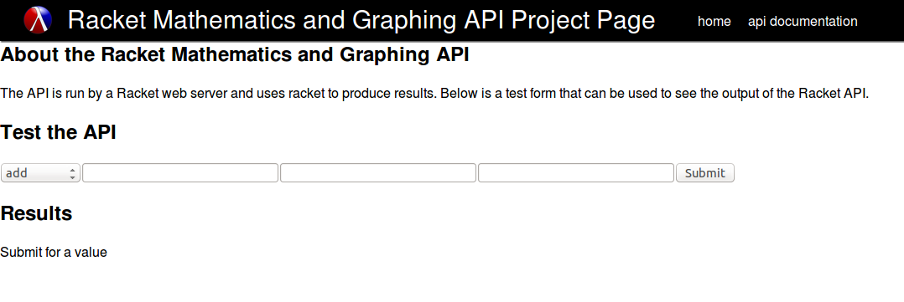
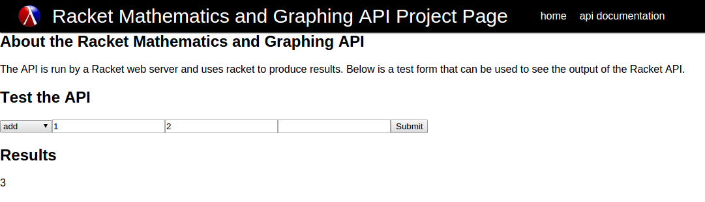

# FP7-webpage Title of Project

##Authors
Jose Flores

Munkhjargal Narmandakh

##Overview
To set up a racket Webserver with API landing points that interpret JSON input, which would then be processed by Racket to evaluated solutions. These solutions would then be returned by the webserver and in JSON form, images would be returned as links.

##Screenshot
An image of the form input before a value is retrieved.


An image of the form input after an addition call.


##Concepts Demonstrated
* **Objects** All components are created as objects with an interface.
* **Data abstraction** Parameter handling interprets a request to a list and back to a string, This allows for data to be passed between object without having to determine how to format it within each object.

##External Technology and Libraries
* [racket/include][racket/include] - Inclusion of files
* [web-server/servlet][web-server/servlet] - The server
* [web-server/servlet-env][web-server/servlet-env] - The server
* [math/number-theory][math/number-theory] - Math Functions
* [math][math] - Math Functions
* [math/base][math/base] - Math Functions
* [web-server/dispatch][web-server/dispatch] - Page delegation
* [web-server/dispatchers/dispatch-servlets][web-server/dispatchers/dispatch-servlets] - Page Delegation
* [net/url-structs][net/url-structs] - Request structure
* [web-server/formlets/input][web-server/formlets/input] - For the form elements


##Favorite Lines of Code
#### Jose

This is my favorite piece of code because it was the hardest part of the puzzle to solve to create the server API that accessed GET variables.

I developed this through the extensive research and having to make a stackoverflow [article][stackoverflow], having to request external help to solve it.

The explanation of what I was trying to do is in the [article][stackoverflow].

The code does not use any specific OPL philosophies, except for using what is present and building up from it. I could have written a parser to extract the values I needed but this uses native procedures and structures to achieve the same result.

```scheme
(define (get-param->string req param)
    (if (eq? #f (bindings-assq (string->bytes/utf-8 param)
                               (request-bindings/raw req)))
        ""
        (bytes->string/utf-8 (binding:form-value (bindings-assq (string->bytes/utf-8 param)
                                                               (request-bindings/raw req))))))
```

#### Munkhjargal
Description
```scheme
MJ code here
```

#How to Download and Run
1. Clone the repository
```
git clone https://github.com/oplS15projects/WOLFRACKET.git
```
2. change directory to WOFRACKET/wolfracket/lib/
```
cd WOFRACKET/wolfracket/lib/
```
3. Run
```
racket driver.rkt
```
4. In the web browser navigate to localhost:8080/home
5. Chose a method in the dropdown and enter values
  * The method has a number of parameters it requires so (2) means the first two parameters),binary operations are in the form of 1st-param OPERATION 2nd-param, and unary are in the form of OPERATION( 1st-param )
6. Submit entry for result


<!-- Links -->
[racket/include]: http://docs.racket-lang.org/reference/include.html
[web-server/servlet]: http://docs.racket-lang.org/web-server/servlet.html
[web-server/servlet-env]: http://docs.racket-lang.org/web-server/run.html#%28mod-path._web-server%2Fservlet-env%29
[math/number-theory]: http://docs.racket-lang.org/math/number-theory.html
[math]: http://docs.racket-lang.org/math/
[math/base]: http://docs.racket-lang.org/math/base.html
[web-server/dispatch]: http://docs.racket-lang.org/web-server/dispatch.html
[web-server/dispatchers/dispatch-servlets]: http://docs.racket-lang.org/web-server-internal/dispatch-servlets.html
[net/url-structs]: http://docs.racket-lang.org/net/url.html#%28mod-path._net%2Furl-structs%29
[web-server/formlets/input]: http://docs.racket-lang.org/web-server/formlets.html#%28mod-path._web-server%2Fformlets%2Finput%29
[stackoverflow]: http://stackoverflow.com/questions/29690651/how-do-you-access-get-parameters-in-racket-server-application/29765739#29765739
